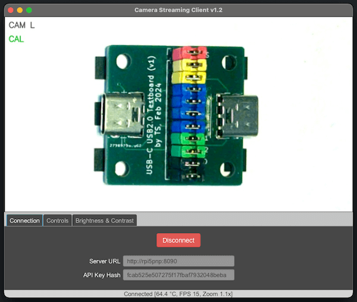
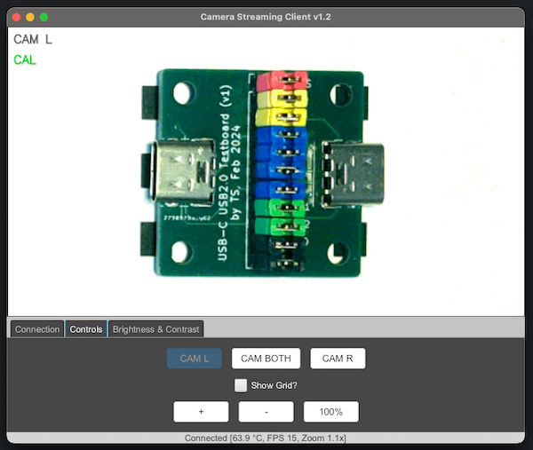
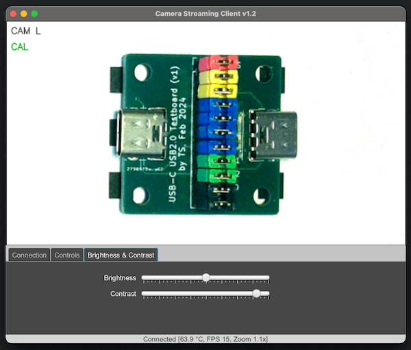
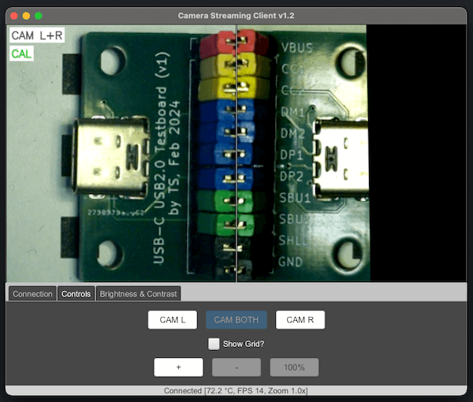

# JavaFX Camera Server Client

This is a JavaFX-based GUI for the [Raspberry Pi 5 Camera Streaming Server](https://github.com/tsitle/rpi5_camera_streaming_server).

It communicates with the server via its REST API over the network and allows the user to monitor
the camera image stream and to control some of the server's capabilities.

## Compiling the application from source

see [docs/README-compiling.md](docs/README-compiling.md)

## Running the application from a precompiled distribution

see [docs/README-run_dist.md](docs/README-run_dist.md)

## Screenshots

Left camera, tab "Connection":

Left camera, tab "Controls":

Left camera, tab "Brightness & Contrast":

Both cameras, tab "Controls":

